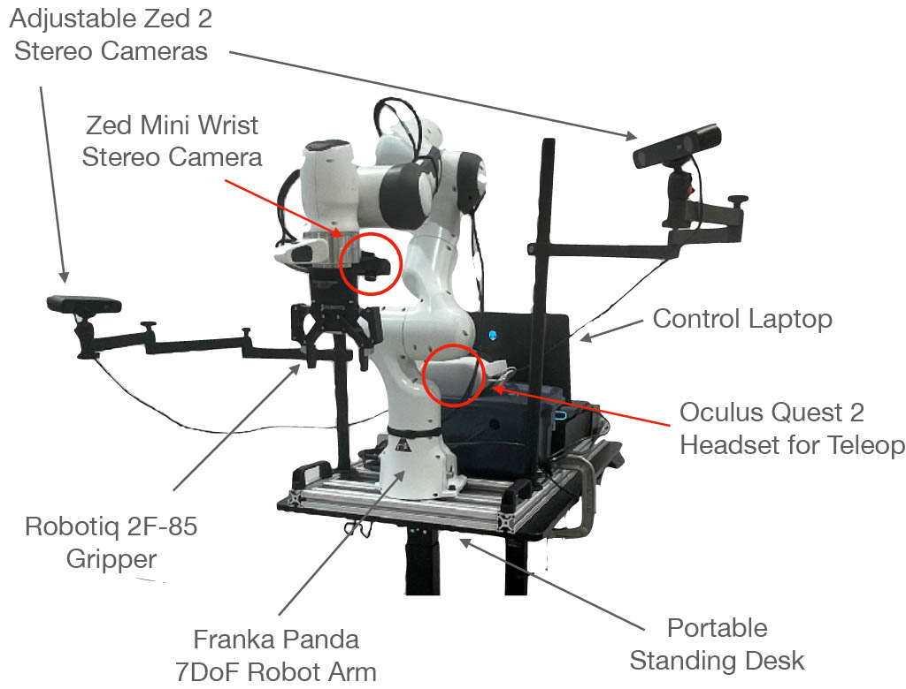

## 🔨 Welcome to the DROID hardware guides

The goal of the hardware guides are to: 

1. Procure all the required hardware components
2. Assemble the hardware components into a functional platform

### Step 1: Procure Hardware Components

The first step to replicate the DROID platform is to procure the required hardware. In the [shopping list](https://droid-dataset.github.io/droid/hardware-setup/shopping-list), we provide an exhaustive list of required components to assemble the platform along with a list of suppliers which you can reference when procuring items. 

### Step 2: Assemble Hardware Components

Once you have acquired the required hardware components, the [assembly guide](https://droid-dataset.github.io/droid/hardware-setup/assembly) will walk you through assembling these components into a functional data collection platform. This includes, mounting the robot, cameras and grippers and a general cable management guide. 

### Final Result

By the end of both guides you should have a platform that resembles the image at the bottom of this page. If/when you get to this point congratulations, you are now ready to progress to the [software setup](https://droid-dataset.github.io/droid/docs/software-setup)

 

