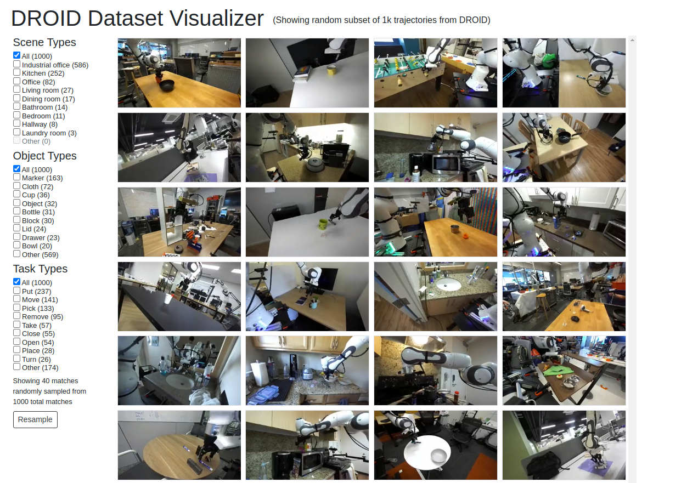

## 🔍 Exploring the Dataset

It is possible to interactively explore the DROID via the following [interactive dataset visualizer](https://droid-dataset.github.io/dataset.html). This is a great way to start understanding the DROID dataset and is a highly recommended starting point.

<a href="https://droid-dataset.github.io/dataset.html"></a>

Additionally, we provide a [Dataset Colab](https://colab.research.google.com/drive/1b4PPH4XGht4Jve2xPKMCh-AXXAQziNQa?usp=sharing) that demonstrates how to load and visualize samples from our dataset.

## 📈 Using the Dataset

The DROID dataset is hosted within a Google Cloud Bucket and is offered in two formats:

1. [RLDS](https://github.com/google-research/rlds): ideal for dataloading for the purpose of training policies
2. Raw Data: ideal for those who wish to manipulate the raw data, use high-resolution images or stereo/depth information.

The DROID dataset is hosted on a Google cloud bucket. To download it, install the [gsutil package](https://cloud.google.com/storage/docs/gsutil_install). We provide three different versions of the dataset for download:
```
# Full DROID dataset in RLDS (1.7TB)
gsutil -m cp -r gs://gresearch/robotics/droid <path_to_your_target_dir>

# Example 100 episodes from the DROID dataset in RLDS for debugging (2GB)
gsutil -m cp -r gs://gresearch/robotics/droid_100 <path_to_your_target_dir>

# Raw DROID dataset in stereo HD, stored as MP4 videos (8.7TB)
gsutil -m cp -r gs://gresearch/robotics/droid_raw <path_to_your_target_dir>

# Raw DROID dataset, non-stereo HD video only (5.6TB, excluding stereo video & raw SVO cam files)
gsutil -m rsync -r -x ".*SVO.*|.*stereo.*\.mp4$" "gs://gresearch/robotics/droid_raw" <path_to_your_target_dir>
```

### Accessing RLDS Dataset

We provide a [Dataset Colab](https://colab.research.google.com/drive/1b4PPH4XGht4Jve2xPKMCh-AXXAQziNQa?usp=sharing) that walks you through the process of loading and visualizing a few samples from the DROID dataset. 

We also provide an example of a "training-ready" data loader that allows for efficient loading of DROID data for policy training (in PyTorch and JAX), including parallelized loading, normalization and augmentation in our [policy learning repo](https://github.com/droid-dataset/droid_policy_learning/blob/master/examples/droid_dataloader.py).


## 📝 Dataset Schema

The following fields are contained in every RLDS episode:
```python
DROID = {
        "episode_metadata": {
                "recording_folderpath": tf.Text, # path to the folder of recordings
                "file_path": tf.Text, # path to the original data file
                },
	"steps": {
		"is_first": tf.Scalar(dtype=bool), # true on first step of the episode
                "is_last": tf.Scalar(dtype=bool), # true on last step of the episode
        	"is_terminal": tf.Scalar(dtype=bool), # true on last step of the episode if it is a terminal step, True for demos
                                
                "language_instruction": tf.Text, # language instruction
                "language_instruction_2": tf.Text, # alternative language instruction
                "language_instruction_3": tf.Text, # alternative language instruction
                "observation": {
                                "gripper_position": tf.Tensor(1, dtype=float64), # gripper position state
                                "cartesian_position": tf.Tensor(6, dtype=float64), # robot Cartesian state
                                "joint_position": tf.Tensor(7, dtype=float64), # joint position state
                                "wrist_image_left": tf.Image(180, 320, 3, dtype=uint8), # wrist camera RGB left viewpoint        
                                "exterior_image_1_left": tf.Image(180, 320, 3, dtype=uint8), # exterior camera 1 left viewpoint
                                "exterior_image_2_left": tf.Image(180, 320, 3, dtype=uint8), # exterior camera 2 left viewpoint
                		},                            
                "action_dict": {
                                "gripper_position": tf.Tensor(1, dtype=float64), # commanded gripper position
                                "gripper_velocity": tf.Tensor(1, dtype=float64), # commanded gripper velocity
                                "cartesian_position": tf.Tensor(6, dtype=float64), # commanded Cartesian position
                                "cartesian_velocity": tf.Tensor(6, dtype=float64), # commanded Cartesian velocity
                                "joint_position": tf.Tensor(7, dtype=float64),  # commanded joint position
                        	"joint_velocity": tf.Tensor(7, dtype=float64), # commanded joint velocity
                		},
		"discount": tf.Scalar(dtype=float32), # discount if provided, default to 1
                "reward": tf.Scalar(dtype=float32), # reward if provided, 1 on final step for demos
                "action": tf.Tensor(7, dtype=float64), # robot action, consists of [6x joint velocities, 1x gripper position]
	},
}
```

### Accessing Raw Data

You can download the raw DROID data using the gsutil command listed above. It contains full-HD stereo videos for all three cameras, alongside with all other information contained in the RLDS dataset. Concretely, each episode folder contains the following information:
```
episode:
   |
   |---- metadata_*.json: Episode metadata like building ID, data collector ID etc.
   |---- trajectory.h5: All low-dimensional information like action and proprioception trajectories.
   |---- recordings:
             |
             |---- MP4:
             |      |
             |      |---- *.mp4: High-res video of single (left) camera view.
             |      |---- *-stereo.mp4: High-res video of concatenated stereo camera views.
             |
             |---- SVO:
                    |
                    |---- *.svo: Raw ZED SVO file with encoded camera recording information (contains some additional metadata)

```

**Note**: We realized that we missed 20% of episodes when face-blurring & copying the *raw* DROID data to the release bucket and are working on uploading the remainder of the dataset. This only affects the *raw* version of DROID, the RLDS version is complete. This should be fixed within a few days -- please reach out to pertsch@berkeley.edu if you have any concerns in the meantime!

## 📄 Data Analysis and Further Information
Please consult the [paper](https://droid-dataset.github.io/paper.pdf) for detailed data analysis and further information about the dataset.
